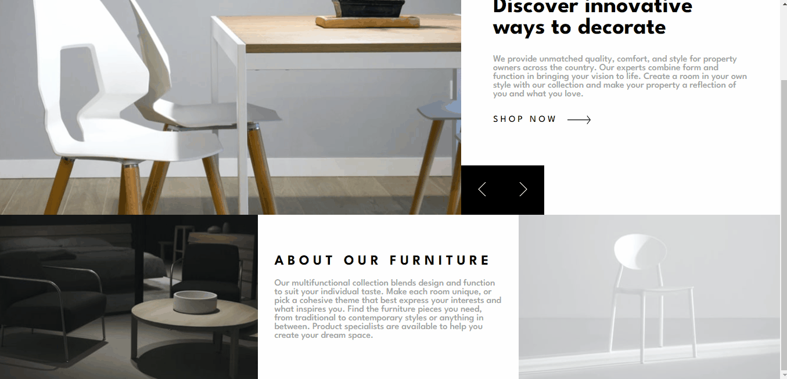
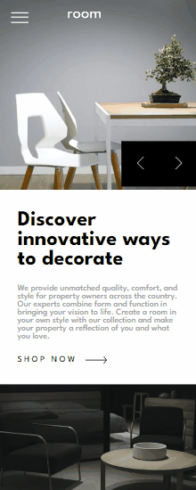

# Desafio Room Homepage - Frontend-Mentor

Este é um desafio de uma Homepage para a Room, proposto pelo site Frontend-Mentor.

## Tabela de Conteúdos

* [Visão Geral](#visão-geral)
    - [Imagens](#imagens)
    - [Link da página](#link)
* [Processo](#processo)
    - [Linguagens utilizadas](#linguagens-utilizadas)
    - [O que aprendi](#o-que-aprendi)
    - [Possíveis evoluções](#possíveis-evoluções)
* [Autor](#autor)

## Visão-geral

### Imagens

<br>

`

```
Versão de Desktop
````

   

<br>

`

```
Versão Mobile
````

 

### Link

* Página no GitHub Pages: <a href="https://julio-mansan2.github.io/room-homepage">Clique aqui!</a>

## Processo

### Linguagens utilizadas

<br>

* Marcações semânticas de HTML5
* Propriedades de customização do CSS3
* Estruturas de JavaScript

<br>

### O que aprendi

<br>

* Ocultar seções diferentes, empilhando-as:

`

```html

<section class="slide-1 slides selecionado">
    
    <nav>
        <input id="menu__toggle" type="checkbox" />
        <label class="menu__btn" for="menu__toggle">
            <span></span>
        </label>

        <ul class="menu__box">
            <li><a href="/">home</a></li>
            <li><a href="/">shop</a></li>
            <li><a href="/">about</a></li>
            <li><a href="/">contact</a></li>
        </ul>
    </nav>
</section>
<section class="slide-2 slides">
    
    <nav>
        <input id="menu__toggle" type="checkbox" />
        <label class="menu__btn" for="menu__toggle">
            <span></span>
        </label>

        <ul class="menu__box">
            <li><a href="/">home</a></li>
            <li><a href="/">shop</a></li>
            <li><a href="/">about</a></li>
            <li><a href="/">contact</a></li>
        </ul>
    </nav>
</section>
<section class="slide-3 slides">
    
    <nav>
        <input id="menu__toggle" type="checkbox" />
        <label class="menu__btn" for="menu__toggle">
            <span></span>
        </label>

        <ul class="menu__box">
            <li><a href="/">home</a></li>
            <li><a href="/">shop</a></li>
            <li><a href="/">about</a></li>
            <li><a href="/">contact</a></li>
        </ul>
    </nav>
</section>
</article>

````

```css

.slides,
.info {
    z-index: 0;
    opacity: 0;
    position: absolute;
}

.selecionado,
.selecionada {
    position: relative;
    z-index: 1;
    opacity: 1;
}

```

* Adicionar ou remover a classe de um elemento:

```html

<div class="buttons">
    <button id="btn-voltar"></button>
    <button id="btn-avancar"></button>
</div>

```

```javascript

const cartaoSelecionado = document.querySelector ('.selecionado')
const infoSelecionado = document.querySelector ('.selecionada')
const sliders = document.querySelectorAll ('.slides')
const info = document.querySelectorAll ('.info')
const btnAvancar = document.getElementById ('btn-avancar')
const btnVoltar = document.getElementById ('btn-voltar')
let cartaoAtual = 0;

function escondercartaoSelecionado (){
    const cartaoSelecionado = document.querySelector ('.selecionado')
    cartaoSelecionado.classList.remove ('selecionado')
}

function mostrarCartao (indiceCartao){
    sliders[cartaoAtual].classList.add ('selecionado');
}

function esconderinfoSelecionado (){
    const infoSelecionado = document.querySelector ('.selecionada')
    infoSelecionado.classList.remove ('selecionada')
}

function mostrarInfo (infoAtual){
    info[cartaoAtual].classList.add ('selecionada');
}

btnAvancar.addEventListener ('click', function (){
        if(cartaoAtual === sliders.length -1) return
        escondercartaoSelecionado ()
        esconderinfoSelecionado ()
        cartaoAtual++;
        mostrarCartao (cartaoAtual)
        mostrarInfo (cartaoAtual)
} )

btnVoltar.addEventListener ('click', function (){
       if(cartaoAtual === 0) return        
        escondercartaoSelecionado ()
        esconderinfoSelecionado ()
        cartaoAtual--;
        mostrarCartao (cartaoAtual)
        mostrarInfo (cartaoAtual)
})
`
```

<br>

### Possíveis evoluções

<br>

* Códigos mais compactos; 
* Entender melhor acerca do posicionamento de algo em "absolute"; 
* Aplicar backgrounds de forma correta.

<br>

## Autor

GitHub - <a href="https://github.com/julio-mansan2">julio-mansan2</a> <br>
Front-end Mentor - <a href="https://www.frontendmentor.io/profile/julio-mansan2">julio-mansan2</a> <br>
LinkedIn - <a href="https://www.linkedin.com/in/j%C3%BAlio-a-mansan-3415a7249/">Júlio A.</a> <br>
